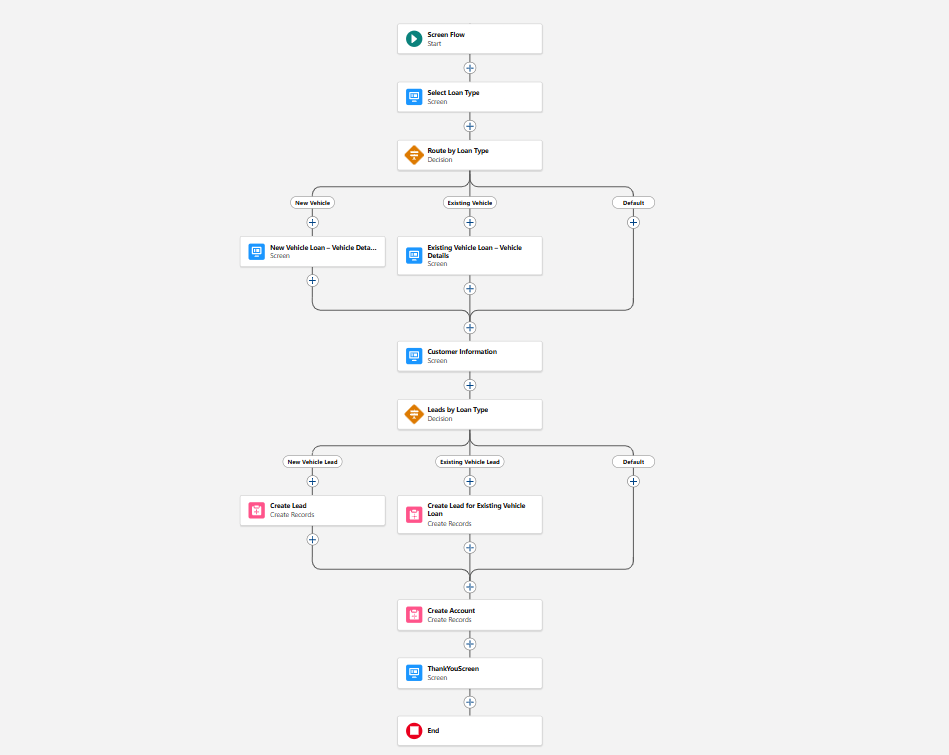

# Vehicle Loan Management System (Salesforce)

## Overview
This repository contains a Salesforce implementation of an end-to-end **Vehicle Loan Management System**, designed to mirror real-world banking workflows rather than a feature demo.

The system covers the complete journey from **lead creation to loan disbursement**, with clear role separation between Sales Users, Relationship Managers (RM), and Branch Managers (BM).  
It is built using **Salesforce Flows, Lightning Web Components (LWC), and standard Salesforce objects**, with an emphasis on process control, data integrity, and extensibility.

---

## Business Flow Summary

Sales User → Lead Creation  
RM → Lead Approval / Rejection  
Approved Lead → Opportunity  
RM → Document Upload & Customer Assessment  
BM → Disbursement Approval  
Loan → Disbursed

---

## Key Features

### Lead Management
- Lead creation via Screen Flows
- RM-based approval or rejection
- Status-driven workflow (no Approval Processes)
- Clean Lead → Opportunity conversion

### Opportunity Processing
- Opportunity auto-populated from Lead data
- Dedicated loan processing lifecycle
- Role-based responsibility (RM vs BM)

### Document Management
- Custom **Lightning Web Component** for document handling
- Structured document checklist (Aadhaar, PAN, RC, etc.)
- Mandatory document enforcement
- Controlled submission using a **Submit Documents** action
- Opportunity becomes the single source of truth for documents

### Process Control
- Explicit stage-based loan lifecycle
- No hidden automation or auto-approvals
- Human checkpoints before every major transition
- Designed to be API-ready for future integrations

---

## Loan Lifecycle Stages

The loan process is driven by a dedicated Opportunity field:

Supported stages:
- Document Upload
- Customer Assessment
- Agreement Generation
- Agreement Signed
- Disbursement
- Disbursed

Each stage represents a clear business milestone and governs what actions are allowed next.

---

## Salesforce Architecture & Tools Used

- **Screen Flows** – Lead intake and approval flows  
- **Lightning Web Components (LWC)** – Document checklist and upload control  
- **Lightning Record Pages** – Role-specific UI experience  
- **Salesforce Files** – Secure document storage  
- **UI Record API** – Safe record updates without Apex  
- **Git + Salesforce DX** – Metadata version control  

This project intentionally avoids deprecated or rigid approaches like classic Approval Processes.

---

## Screenshots

### 1. Lead Intake Screen Flow

## Deployment Instructions

1. Clone the repository  
2. Authenticate to your Salesforce org (Sandbox or Scratch Org)  
3. Deploy metadata using Salesforce CLI  
4. Assign required permissions and page layouts  
5. Configure Opportunity Lightning Page with custom components  

This project is designed to work in non-source-tracked orgs with explicit metadata retrieval.

---

## Design Philosophy

- Prefer **explicit process control** over implicit automation  
- Separate **decision stages** from **execution stages**  
- Use Salesforce defaults where appropriate, extend only when required  
- Design for real operational behavior, not just UI convenience  

---

## Future Enhancements

- API-based PAN, Aadhaar, and CERSAI validations  
- Automated risk profiling (Low / Medium / High)  
- Loan agreement PDF generation  
- BM disbursement automation  
- Dashboard & reporting for RM and BM performance  

---

## Author

**Ankit Wagh**  
Salesforce Developer  

---

## License
This project is licensed under the MIT License.